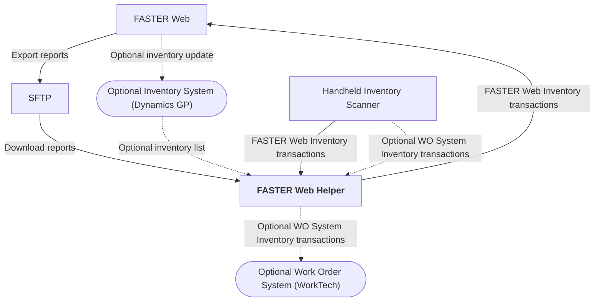

# FASTER Web Inventory Scanner

🧑‍💻 **Under development**

A solution for issuing inventory using handheld barcode scanners.

- Lets storeroom staff use handheld scanners to issue parts on FASTER Web work orders.

- Generates a log of inventory usage transactions that are later synchronized with FASTER Web
  using the Inventory Import Utility integration.

- Optionally collects inventory usage transactions for another work order system (i.e. WorkTech)
  using the same common scanning interface.

## Layout

## Requirements

- ⚙️ **Inventory Import Utility** integration.
- 📂 **SFTP access** for sending and receiving files.

### Optional Excel Reports Regularly Exported to FTP

- 📄 **W311 - Active Work Orders by Shop**, for Work Order validation.
- 📄 **W200 - Inventory Report**, for Item Number validation.
- 📄 **W604 - Integration Log Viewer**, filtered to the **Inventory Import Utility** integration, to check for import errors.
