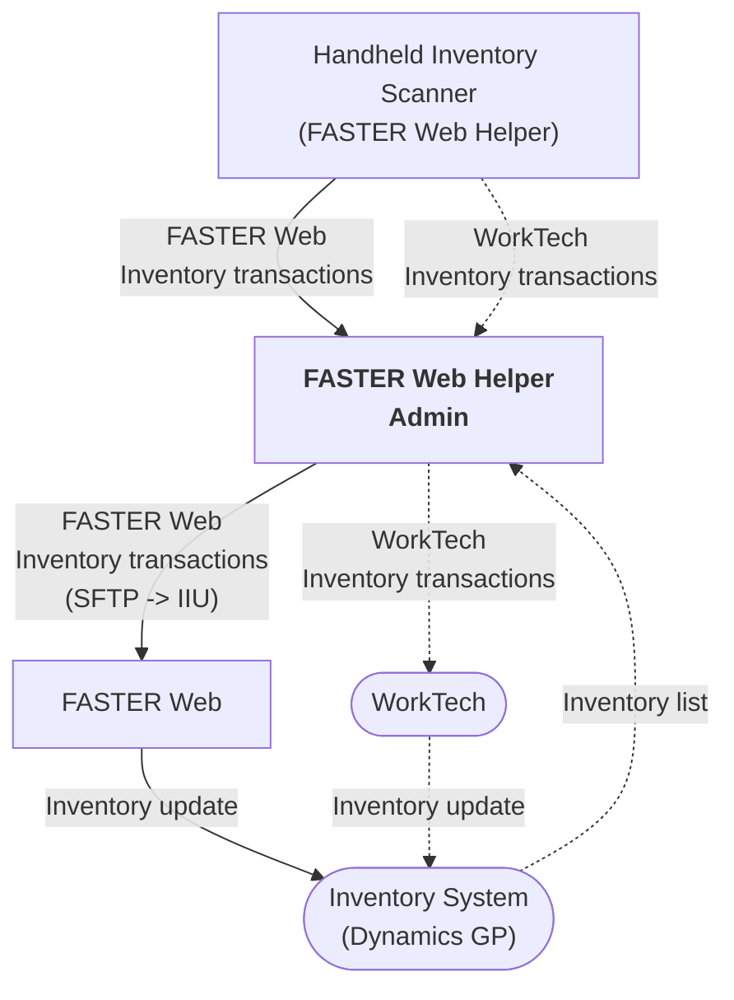

# FASTER Web Inventory Scanner

🧑‍💻 **Under development**

A solution for issuing inventory using handheld barcode scanners.

- Lets storeroom staff use handheld scanners to issue parts on FASTER Web work orders.

- Generates a log of inventory usage transactions that are later synchronized with FASTER Web
  using the Inventory Import Utility (IIU) integration.

- Optionally collects inventory usage transactions for another work order system (i.e. WorkTech)
  using the same common scanning interface.

## Requirements

- ⚙️ **Inventory Import Utility** integration.
- 📂 **SFTP access** for sending files.

### Optional Requirements

- Access to the FASTER Web API and 🔒 `@cityssm/faster-api` package.
- WorkTech work order system.

## Process Layout

## Detailed Workflow

1. Store room staff use handheld scanners to create records of parts to issue to
   FASTER Web or WorkTech work orders.
   The same interface is used for both types of work orders.
   Records are saved to a database outside of the work order systems.

2. Verification and validation is done with the FASTER Web Helper application.
   This includes:

   - Using the FASTER Web API to applying missing FASTER Web repair ids.
   - Using the inventory system (Dynamics GP) to retrieve current available quantities and unit costs.

3. Verified records are synced to the appropriate work order systems.
   - FASTER Web transactions are exported to a file.
     The file is uploaded to an FTP folder.
     The folder is available to the FASTER Web Inventory Import Utility (IIU) integration.
     The FASTER Web IIU receives the file, and applies the transactions to the work orders.
   - WorkTech transactions are inserted directly into the WorkTech database
     as a Stock Batch.
