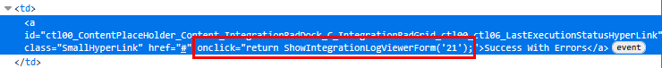
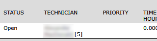

# FASTER Web Inventory Scanner

🧑‍💻 **Under development**


A solution for issuing inventory using handheld barcode scanners.

- Lets storeroom staff use handheld scanners to issue parts on FASTER Web work orders.

- Generates a log of inventory usage transactions that are later synchronized with FASTER Web
  using the Inventory Import Utility (IIU) integration.

- Optionally collects inventory usage transactions for another work order system (i.e. WorkTech)
  using the same common scanning interface.

## Requirements

- ⚙️ **Inventory Import Utility** integration.
- 📂 **SFTP access** for sending files.

### Optional Requirements

- Access to the FASTER Web API and 🔒 `@cityssm/faster-api` package.
- WorkTech work order system.

## Process Layout


## Detailed Workflow

1. **Capture transactions.**<br />
   Store room staff use handheld scanners to create records of parts to issue to
   FASTER Web or WorkTech work orders.
   The same interface is used for both types of work orders.
   Records are saved to the FASTER Web Helper database, outside of the work order systems.

2. **Verify and validate transactions.**<br />
   Verification and validation is done with the FASTER Web Helper application.
   This includes:

   - Using the FASTER Web API to applying missing FASTER Web repair ids.
   - Using the inventory system (Dynamics GP) to retrieve current available quantities and unit costs.

3. **Update work order systems.**<br />
   Verified records are synced to the appropriate work order systems.

   - FASTER Web transactions are exported to a file.
     The file is uploaded to an FTP folder.
     The folder is available to the FASTER Web Inventory Import Utility (IIU) integration.
     The FASTER Web IIU receives the file, and applies the transactions to the work orders.
   - WorkTech transactions are inserted directly into the WorkTech database
     as a Stock Batch.

4. **Update inventory.**<br />
   Work order systems update the quantities in the inventory.
   This ensures that any inventory-related transactions occurring outside of the FASTER Web Helper
   are properly captured (i.e. returns).

## Configuration

### FASTER Web Configuration

#### Inventory Import Utility (IIU) Configuration


See the FASTER Web Help Documentation for configuring the integration.

When it comes to scheduling, the FASTER Web Helper application
does have the ability to run the integration on demand (i.e. after uploading a new file).
It is recommended as a backup, to schedule the IIU to run after your regular upload time.
So for example, if you regularly upload your day's work at 4pm,
you could schedule the IIU process to run at 5pm, to ensure records are processed.

#### User with FASTER Web Access

Some functions in this module are performed by scripting a headless web browser
to log into the FASTER Web application and click certain buttons.
For example, there is no other way to retrieve IIU error logs on demand,
or to execute the IIU integration on demand.

The user use built-in FASTER authentication, not Active Directory.
At minimum, the user should have access to the "Reports" and "Integrations" domains,
and access to the appropriate organizations, storerooms, and maintenance shops.

#### User with FASTER Web API Access

To perform some tasks, the official FASTER Web API is required.
Due to a restrictive non-disclosure agreement around the API, not much is said here. 😔

### FASTER Web Helper Configuration

Below is a partial `config.js` file with configuration specific to the Inventory Scanner module.

When possible, use TypeScript to build the config file for assistance.

```javascript
export const config = {
  // ...

  // fasterWeb
  // To run API calls.
  fasterWeb: {
    tenantOrBaseUrl: 'faster-tenant',

    // For official API calls.
    // Note that optional, private @cityssm/faster-api package required.
    apiUserName: 'apiUser',
    apiPassword: 'apiPassword',

    // For unofficial API calls.
    // User must have access to "Reports" to export
    // "W603 - Message Logger"
    // and "Integrations" to run the IIU on demand.
    appUserName: 'appUser',
    appPassword: 'appPassword'
  },

  // ftp
  // To upload files for the IIU integration.
  ftp: {
    // See access options for basic-ftp
    // https://www.npmjs.com/package/basic-ftp
    host: 'ftpHost',
    user: 'ftpUser',
    password: 'ftpPassword'
  },

  // worktech
  // Required for Worktech integrations.
  worktech: {
    // See connection options for mssql
    // https://www.npmjs.com/package/mssql
    server: 'dbServer',
    user: 'dbUser',
    password: 'dbPassword',
    database: 'dbDatabase'
  },

  // dynamicsGp
  // Required for Dynamics GP integrations.
  dynamicsGP: {
    // See connection options for mssql
    // https://www.npmjs.com/package/mssql
    server: 'dbServer',
    user: 'dbUser',
    password: 'dbPassword',
    database: 'dbDatabase'
  },

  // ntfy
  // An optional notification service.
  // Find out more at https://ntfy.sh/
  ntfy: {
    server: 'https://ntfy.sh'
  },

  modules: {
    // inventoryScanner
    // Specific settings for the module.
    inventoryScanner: {
      // Must be true to run.
      isEnabled: true,

      // Regular expression for IP addresses
      // accessing the handheld scanner interface.
      scannerIpAddressRegex: /:192\.168(\.\d+){2}$/,

      // IIU options
      fasterSync: {
        // The ID associated with the IIU integration.
        // If the official API is available,
        // this allows for a log message to be created
        // when a new file is uploaded for processing.
        // See below how to find this number.
        integrationId: 1,

        // The FTP folder to upload to.
        ftpPath: 'inventoryImport',

        // The prefix for uploaded files.
        // Should match "Export File Name Prefix" in the IIU Setup.
        exportFileNamePrefix: 'inventoryImport_',

        // The default technician ID.
        // See below how to find technician IDs.
        defaultTechnicianId: 4
      },

      // Work order validation settings
      workOrders: {
        // Whether or not WorkTech work orders are allowed.
        acceptWorkTech: true,

        // Where to compare work order numbers to check for validity.
        // Note that optional, private @cityssm/faster-api package is required.
        validationSources: ['fasterApi', 'worktech']
      },

      // Item validation settings
      items: {
        acceptNotValidated: true,
        itemNumberRegex: /^\d{2}-\d{4}-\d{5}$/,
        placeholder: 'nn-nnnn-nnnnn',
        validation: {
          source: 'dynamicsGP',
          gpLocationCodesToFasterStorerooms: {
            'gpLocation': 'fasterStoreroom'
          },
          gpItemFilter(item) {
            return (
              item.itemShortName !== 'REMOVED' &&
              !item.itemDescription.startsWith('REMOVED - ') &&
            )
          }
        }
      },

      // FASTER Item Requests
      fasterItemRequests: {
        // Whether or not to check for outstanding item requests.
        // Note that optional, private @cityssm/faster-api package is required.
        isEnabled: true,

        ntfy: {
          // Whether or not to send a notifcation using ntfy.
          isEnabled: true,

          // The topic associated with the notification.
          topic: 'secretTopic'
        }
      }
    }
  }

  // ...
}

export default config
```

#### FASTER Web Helper Configuration FAQs

##### How do I find the `integrationId` for the Inventory Import Utility?

**If you know of an easier way to do this, please reach out!**

These instructions may very slightly between web browsers.


In FASTER Web, navigate to the Integrations section.
Look for the "Inventory Import Utility" row.
Right click the "Last Execution Status".
Select "Inspect".



Looking at the source code, the `integrationId` is the number inside the `onclick` function.
IN the example above, the `integrationId` is `21`.

##### How do I find a `technicianId`?

Find a work order that includes a repair that the technician has been assigned to.



The `technicianId` appears next to the technician's name in the Repair section.

Alternatively, you can perform a similar "Inspect" process described for finding the `integrationId`.
See "Setup" > "Maintenance" > "Technician".
Inspect the technician's corresponding "Edit" button.

##### How do I install the @cityssm/faster-api package?

Due to a restrictive non-disclosure agreement around the official FASTER API,
the code used to access it is isolated to a private repository on GitHub.

If you can prove to have access to the FASTER API,
access can be granted to the private repository.

## Handheld Scanner Setup

To get the most out of the Inventory Scanner module,
the bulk of the data input should be done using a handheld device with a barcode scanner.
This alleviates the needs to type work order numbers and item numbers.

Companies like Zebra and Honeywell offer Android-based devices
with screens the size of phone screens, and built-in barcode capturing cameras.
Brand name devices are not required, so there is a potential for savings.
Essentially, the device should run a maintained operating system
with the ability to install a current web browser.

If you are using the optional [ntfy](https://ntfy.sh/) notifications,
you should install the ntfy app on your device to recieve those notifications.